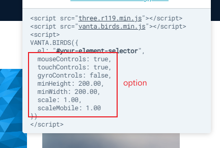

# hexo-butterfly-vanta

一些背景效果，使用 [vantajs](https://github.com/tengbao/vanta)

## 配置

在 hexo 根目錄配置

```yaml
vanta:
  enable:
  effect:
  option:
```

| 參數   | 解釋                                                  |
| ------ | ----------------------------------------------------- |
| enable | 是否開啟 vanta                                        |
| effect | 配置顯示的效果(例如 birds)，具體可查看 vantajs 的網站 |
| option | 一些額外的配置，除了 `el`                             |



option 可配置為

```yaml
option:
  mouseControls: true
  touchControls: true
  gyroControls: false
  minHeight: 200.00
  minWidth: 200.00
  scale: 1.00
  scaleMobile: 1.00
```

## 效果

可到 [vanta](https://www.vantajs.com/) 查看效果
